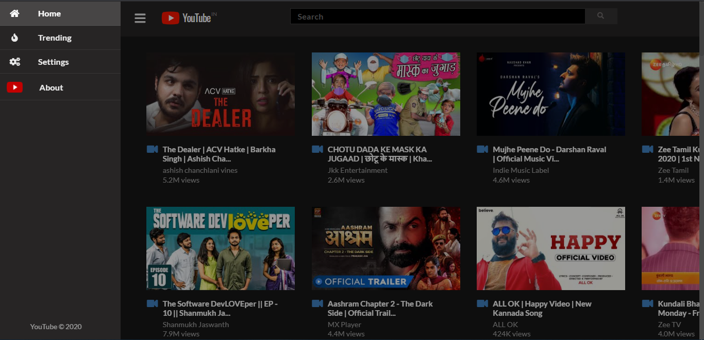
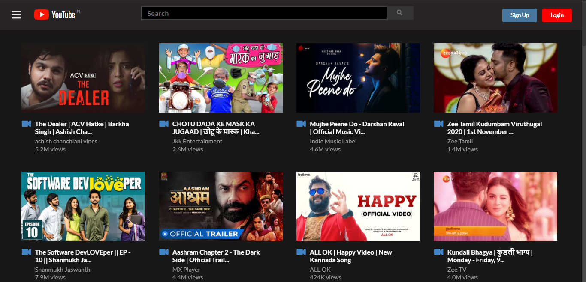
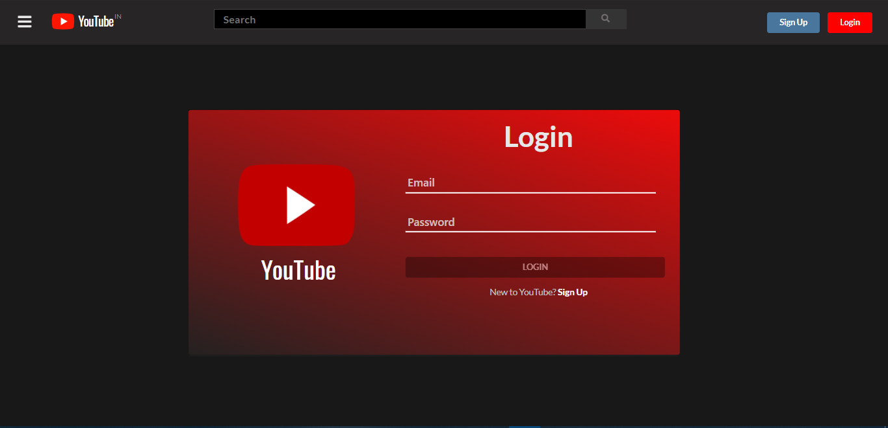
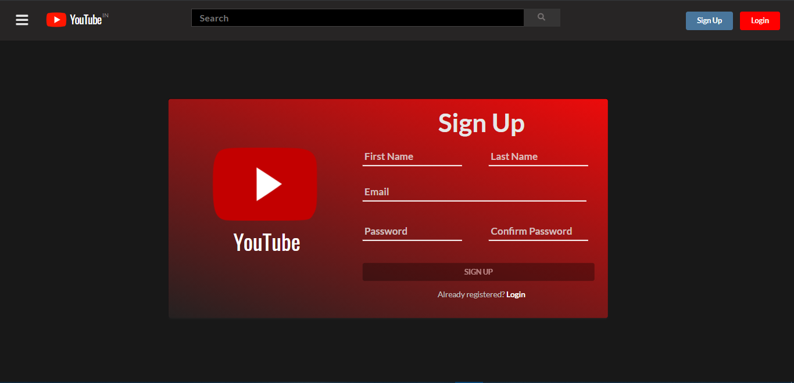
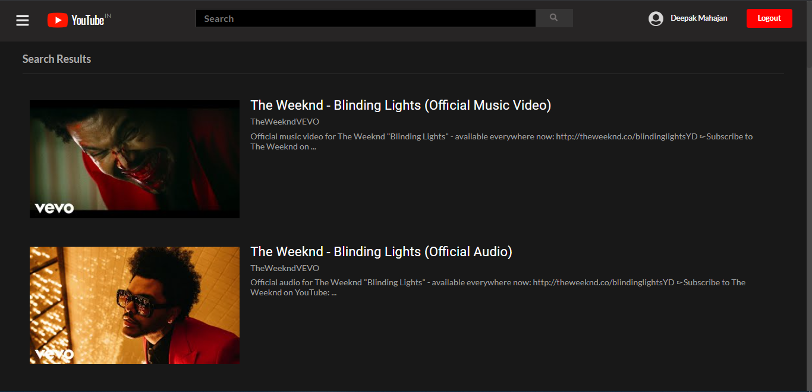
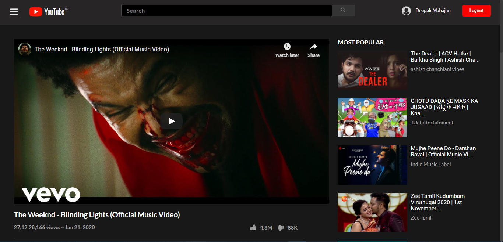
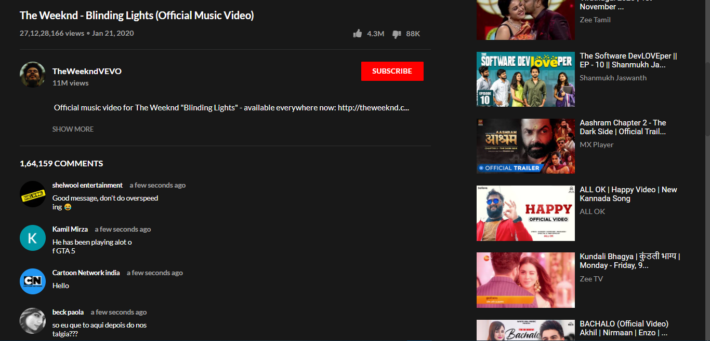

# Youtube-Clone
Youtube Clone build with MEAN Stack.
* Backend with NodeJS and Express.
* NoSQL database with MongoDB for user authentication and registration.
* Angular framework for Front-end with CSS framework as Semantic-UI.
* Youtube API v3 for fetching youtube related data.
### Here are some pictures related the project:

